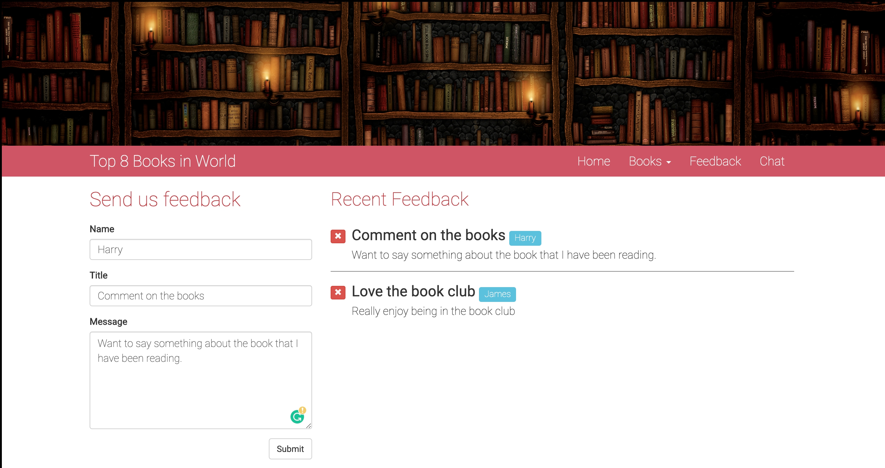

https://krishna-thapa.github.io/NodeJsExpress/

# Summary of the project
Simple web-based application using [Node.js and express](http://expressjs.com/) for front-end and backend. It used mock json data instead of any database server.

Project shows the simple CRUD implementation using the online book keeping system. Most of the front-end template uses the [.enjs](https://ejs.co/) extension and methods and routers are written with JavaScript. 

## Installing
1. Make sure you have these installed
	- [node.js and npm](http://nodejs.org/)
	- [git](http://git-scm.com/)
2. Clone this repository into your local machine using the terminal (mac) or Gitbash (PC) 
- `> git clone CLONEURL`
3. CD to the folder `cd FOLDERNAME`
- Run `> npm install -g nodemon` to install nodemod globally
- Run `> npm install` to install the project dependencies
- Run `> npm start` command to start the automation

## CI/CD pipeline 
- Use of the [circleci](https://circleci.com/) to build the image and run the test 
- Use of the [Docker hub](https://hub.docker.com/) to upload the image and run the container 
- **WIP** Deploy the container in the cloud hosting in [heroku](https://www.heroku.com/)

## Demonstration

